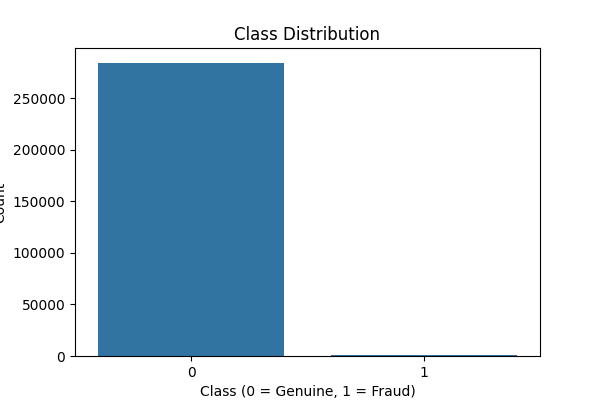
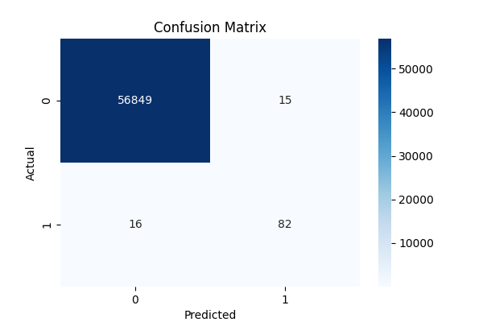
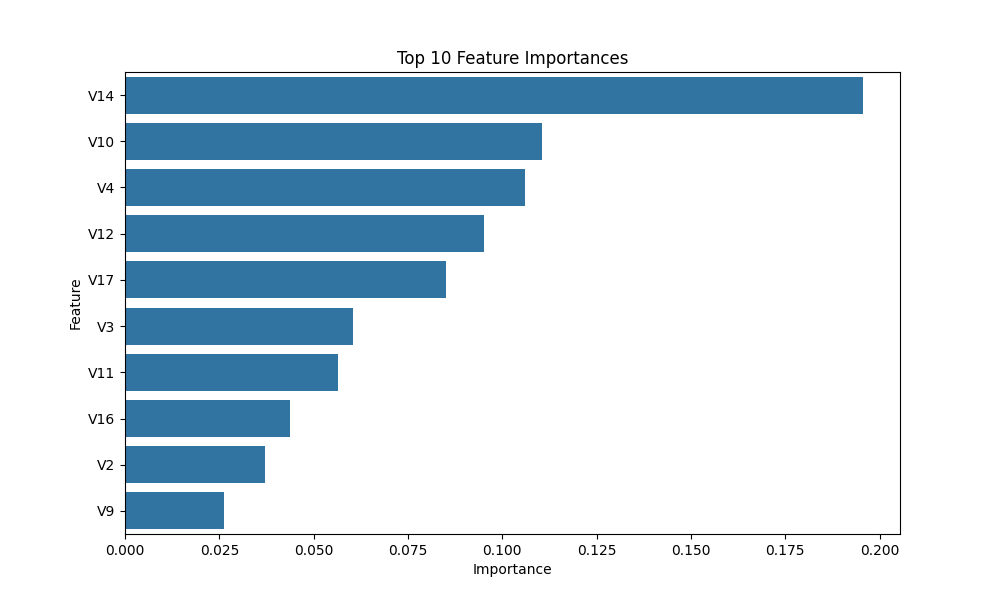

# credit-card-fraud-detection
Machine Learning project for detecting fraudulent credit card transactions using Random Forest.
# Credit Card Fraud Detection using Random Forest and SMOTE

## Overview

This project uses Machine Learning to detect fraudulent credit card transactions. Since fraud cases are extremely rare compared to legitimate transactions, the dataset is highly imbalanced. To address this issue, SMOTE (Synthetic Minority Over-sampling Technique) was used to improve the model's ability to detect fraudulent transactions.

The project includes data preprocessing, feature scaling, class imbalance handling, model training, evaluation, feature importance analysis, visualization, and model persistence.

---

## Dataset

Dataset: Credit Card Fraud Detection

Source:
https://www.kaggle.com/datasets/mlg-ulb/creditcardfraud

### Dataset Information

* Total Transactions: 284,807
* Features: 30
* Target Variable: Class
* Legitimate Transactions: Class = 0
* Fraudulent Transactions: Class = 1

The features V1–V28 are anonymized using PCA to protect sensitive information.

---

## Technologies Used

* Python
* Pandas
* NumPy
* Scikit-Learn
* Imbalanced-Learn (SMOTE)
* Matplotlib
* Seaborn
* Joblib

---

## Project Workflow

1. Load and inspect the dataset
2. Handle missing values
3. Scale Time and Amount features
4. Split data into training and testing sets
5. Apply SMOTE to balance classes
6. Train a Random Forest Classifier
7. Evaluate model performance
8. Analyze feature importance
9. Save the trained model and scaler
10. Generate visualizations

---

## Model

### Random Forest Classifier

Parameters:

* n_estimators = 100
* random_state = 42

### Handling Class Imbalance

SMOTE was applied to the training data to generate synthetic fraud samples and improve fraud detection performance.

---

## Results

### Model Performance

Accuracy: 99.95%

Confusion Matrix:

|                | Predicted Genuine | Predicted Fraud |
| -------------- | ----------------- | --------------- |
| Actual Genuine | 56849             | 15              |
| Actual Fraud   | 16                | 82              |

Classification Report:

| Metric    | Fraud Class |
| --------- | ----------- |
| Precision | 0.85        |
| Recall    | 0.84        |
| F1-Score  | 0.84        |

The model successfully detected a large proportion of fraudulent transactions while maintaining a low false positive rate.

---

## Visualizations

### Class Distribution



### Confusion Matrix



### Feature Importance



---

## Project Structure

```text
credit-card-fraud-detection/
│
├── notebooks/
│   └── fraud_detection.ipynb
│
├── models/
│   ├── fraud_model.pkl
│   └── scaler.pkl
│
├── images/
│   ├── class_distribution.png
│   ├── confusion_matrix.png
│   └── feature_importance.png
│
├── README.md
├── requirements.txt
└── .gitignore
```

---

## Running the Project

1. Clone the repository

```bash
git clone <repository-url>
```

2. Install dependencies

```bash
pip install -r requirements.txt
```

3. Run the notebook

```bash
jupyter notebook
```

4. Open:

```text
notebooks/fraud_detection.ipynb
```

---

## Future Improvements

* Hyperparameter tuning using GridSearchCV
* Comparison with Logistic Regression and XGBoost
* Deployment using Flask or FastAPI
* Real-time fraud detection API
* Model explainability using SHAP

---

## Key Learnings

* Handling imbalanced datasets
* Applying SMOTE
* Random Forest Classification
* Feature Scaling
* Model Evaluation using Precision, Recall, and F1-Score
* Feature Importance Analysis
* Saving and Loading ML Models

---

## Author

Mahalaxmi

Cybersecurity Student | Machine Learning Enthusiast
